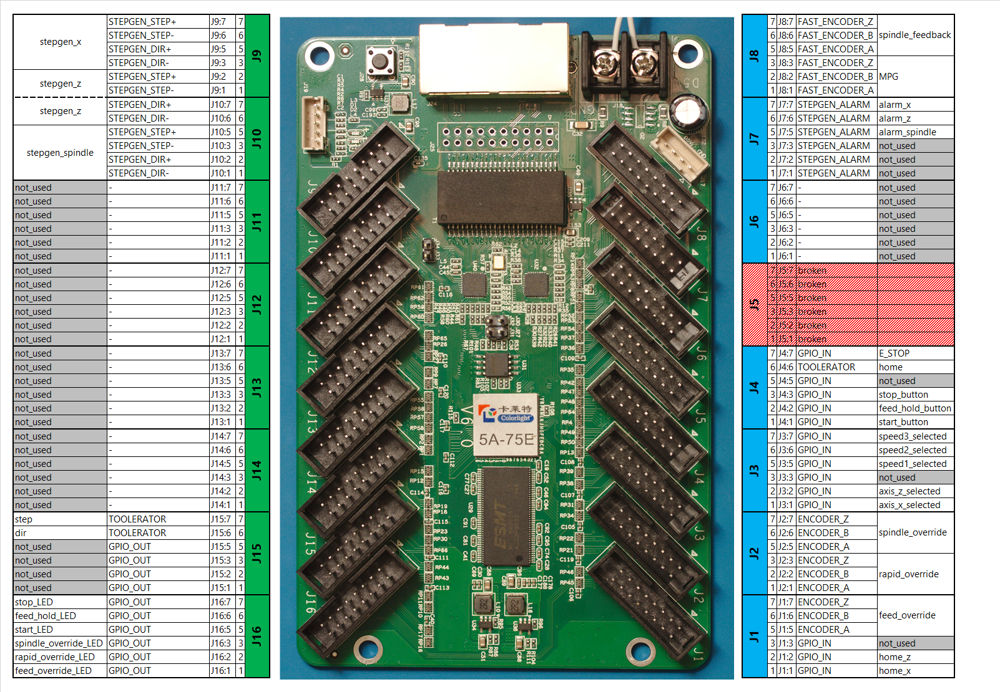

# EMCO5
Machine config for EMCO5

# Requirements
The EMCO5 runs on LinuxCNC version 2.8.2. The firmware is designed with:
- `litexcnc`
- `litexcnc_toolerator`

Both packages are for now installed directly from their respective git repositories:
``` shell
pip3 install litexcnc[cli] @ git+https://github.com/Peter-van-Tol/LiteX-CNC@11-add-external-extensions-to-litexcnc
pip3 install git+https://github.com/Peter-van-Tol/Litex-CNC-toolerator
```

Alternatively, the file `requirements.txt` can be used:
``` shell
pip3 install -r requirements.txt
```

**NOTE**: depending on the system it might be required to use the switch `--user` to install
the required packages. If the switch `--user` is required to install the packages above, the
switch must also be used in the following commands.

After installing Litex-CNC (including the toolerator and dependencies), the toolchain
can be installed:
``` shell
litexcnc install_litex [--user]
litexcnc install_toolchain [--user]
```

# Firmware
As CNC-card a Colorlight 5A-75E has been selected. To allow for inputs, the buffers on J1-J8 
have been replaced. The new buffers are hard-wired to be inputs. All inputs are 5V tolerant, 
all outputs will supply 5V to their outputs.



The design has been converted into the configuration file [emco5.json](./firmware/emco5.json),
which has been built using the command:
``` shell
litexcnc build_firmware ./firmware/emco5.json --build -o build
```


# TODO
This is my TODO-list for getting the EMCO5 up and running:
- toolerator produces an error when enabling the home pin
- HAL has to be build with aliases
